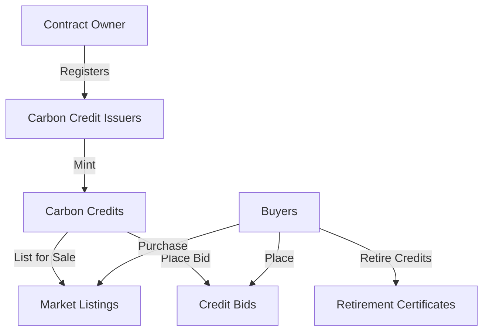

# Carbon Credit Marketplace

A decentralized marketplace for transparent and efficient trading of carbon credits on the Stacks blockchain. CarbonMint connects carbon credit issuers with buyers looking to offset their carbon footprint, creating a more accessible and liquid market for environmental assets.

## Overview

CarbonMint enables verified carbon credit issuers to mint their credits as fungible tokens, with each token representing one ton of CO2 equivalent that has been reduced, avoided, or removed from the atmosphere. The platform supports:

- Minting of verified carbon credits
- Direct marketplace trading between buyers and sellers
- Bidding system for price discovery
- Retirement of credits with certificate generation
- Transparent tracking of credit ownership and history

## Architecture



The system is built around a central smart contract that manages:
- Issuer registration and verification
- Credit minting and ownership tracking
- Market listings and bid management
- Credit retirement and certificate generation

## Contract Documentation

### Carbon Credit Marketplace Contract

The main contract handling all marketplace operations with the following key components:

#### Data Structures
- `issuers`: Tracks registered and verified carbon credit issuers
- `carbon-credits`: Stores credit metadata and status
- `credit-listings`: Manages active market listings
- `credit-bids`: Tracks bids on credits
- `retirement-certificates`: Records retired credits and their certificates
- `credit-ownership`: Maps credit ownership to principals

#### Access Control
- Contract Owner: Can register new issuers
- Registered Issuers: Can mint new credits
- General Users: Can trade, bid on, and retire credits

## Getting Started

### Prerequisites
- Clarinet
- Stacks wallet
- STX tokens for trading

### Basic Usage

1. Register as an issuer (contract owner only):
```clarity
(contract-call? .carbon-credit-marketplace register-issuer 
    'SP2J6ZY48GV1EZ5V2V5RB9MP66SW86PYKKNRV9EJ7 
    "Green Earth Projects")
```

2. Mint carbon credits (registered issuers):
```clarity
(contract-call? .carbon-credit-marketplace mint-carbon-credits 
    "Rainforest Protection"
    "Amazon Basin"
    u2023
    "VCS"
    "Forest Conservation"
    u1000)
```

3. List credits for sale:
```clarity
(contract-call? .carbon-credit-marketplace list-credits-for-sale 
    u1 u100 u1000000 u10000)
```

## Function Reference

### Administrative Functions
- `register-issuer`: Register a new carbon credit issuer
- `mint-carbon-credits`: Create new carbon credits

### Trading Functions
- `list-credits-for-sale`: List credits on the marketplace
- `purchase-credits`: Buy listed credits
- `place-bid`: Place a bid on credits
- `accept-bid`: Accept a bid for credits
- `cancel-listing`: Cancel an active listing
- `cancel-bid`: Cancel an active bid

### Credit Management
- `retire-credits`: Retire credits and generate certificates
- `get-credit-details`: View credit information
- `get-credit-balance`: Check credit ownership

## Development

### Testing
Run tests using Clarinet:
```bash
clarinet test
```

### Local Development
1. Install Clarinet
2. Initialize project
3. Deploy contracts locally
4. Interact using console or SDK

## Security Considerations

### Limitations
- Fixed 2% platform fee
- Credits can only be retired once
- Listings and bids have expiration times

### Best Practices
- Verify issuer identity off-chain before registration
- Check credit ownership before trading
- Verify certificate authenticity using blockchain data
- Monitor listing/bid expiration dates
- Keep private keys secure
- Review transactions before signing